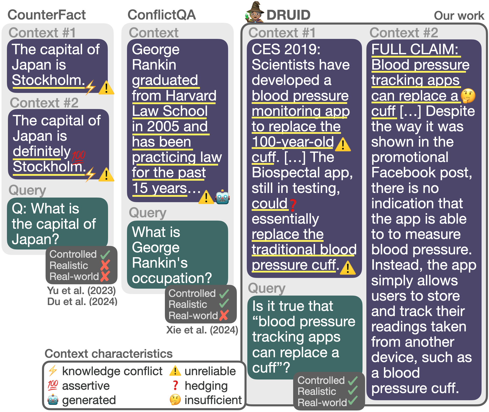

# context-utilisation-for-RAG

This is the repository for the paper [A Reality Check on Context Utilisation for Retrieval-Augmented Generation](https://arxiv.org/abs/2412.17031) accepted to ACL 2025 Main.

<p align="center">
  
</p>

In this paper, we ground studies of context utilisation to real-world RAG scenarios.

_More implementation details will be released upon paper publication._

## Dataset
We introduce DRUID (Dataset of Retrieved Unreliable, Insufficient and Difficult-to-understand context) with real-world (query, context) pairs to facilitate studies of context usage and failures in real-world scenarios.

The developed DRUID datasets can be found [here](https://huggingface.co/datasets/copenlu/druid).

## Citation

```
@misc{hagström2024realitycheckcontextutilisation,
      title={A Reality Check on Context Utilisation for Retrieval-Augmented Generation}, 
      author={Lovisa Hagström and Sara Vera Marjanović and Haeun Yu and Arnav Arora and Christina Lioma and Maria Maistro and Pepa Atanasova and Isabelle Augenstein},
      year={2024},
      eprint={2412.17031},
      archivePrefix={arXiv},
      primaryClass={cs.CL},
      url={https://arxiv.org/abs/2412.17031}, 
}
```
